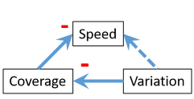

=The Dimensions of Tests Model=

**TL;DR:** Software developers often decide what tests to write based on technical aspects. Instead they should what tests to write based on what feedback is missing. The Dimensions of Tests Model can be used to make better decisions around what tests to write.  Useful dimensions to use when deciding what type of tests you should write are primarily: speed of feedback, coverage, longevity and variation.  

--------
The current thinking in the software development industry is to have a lot of low-level unit tests, fewer integration tests, and fewer still, higher-level tests like system tests. The Test Pyramid, shown below, is a common model used to describe the relative amounts or ratios of the different types of tests we should aim for. 

This kind of thinking generally focuses on how quickly the tests run - i.e. speed of feedback - and also how easy it is to write the different types of tests. Both of these are technical considerations. The problem I have with this thinking is it ignores the primary reason we have tests in the first place - to get feedback about our system. If technical considerations govern the types of tests we have, there may be a large number of tests we will never write, and thus a lot of feedback we're not getting. For example, having lots of low-level unit tests doesn't give us any information about how the components in a system work together as a whole. Evidence of this phenomenon is the multitude of memes around unit testing not being enough. Some of my favourites (click the pictures for the original Tweets):  

     

Focusing on technical considerations only leads us to make blind trade-offs: we're not even aware of other dimensions we should be considering when deciding which tests to write. The Dimensions of Tests Model was developed to make other dimensions explicit and to help teams make better trade-offs around the types of tests they write. The model is predicated on the idea that *different tests are valuable to different audiences at different times, for different reasons*.

The dimensions I think are most important are:  
 * **Speed**: How quickly does the test execute? How long do we have to wait to get the feedback the test gives us?   
 * **Coverage**:  How much of the system (vertically) does the test exercise? In general, the higher the coverage, the more confident we are about the behaviour of the system as whole. Also known as *scope* or *depth*.
 * **Longevity**: For how long do we expect the information provided by this test to be of value? In general, the longevity of a test is related to how many people are interested in the information provided by the test (audience).  
 * **Variation**:  How many near-identical variations of the test are there? E.g. if a test has lots of inputs, there may be very many combinations of inputs, with each combination requiring its own test. ([This article](http://blog.thecodewhisperer.com/permalink/integrated-tests-are-a-scam-part-1) is useful for more on this idea.)

In an ideal world, every test would execute instantaneously, cover the entire system, and would be valuable forever. A suite of such tests would also cover every combination of inputs and states as well. Therefore, the ideal test would score very highly in all dimensions. Unfortunately this is not possible in the real world since some of the dimensions have an inverse affect on others. The image below is a causal loop diagram showing the causal relationships between dimensions.

 * An increase in *Coverage* generally leads to a decrease in *speed of feedback*. This is because the more of the system covered by the test, the longer the test takes to run.   
 * An increase in *Coverage* generally leads to an increase in *Longevity*. This is because tests which exercise most or all of the system are generally less coupled to the implementation, and are written in higher-level (domain) language which will not change frequently, and is also valuable to a very wide audience. Inversely, lower Coverage leads to lower *Longevity* since low-coverage tests are more coupled to low-level component design, which changes more frequently.
 * An increase in *Variation* generally leads to a decrease in coverage. This is because with high variation, we will have a large number of tests. They must be low-coverage in the interests of time.

As the model shows, no test can ever maximise for all dimensions. Any test will compromise on some of the dimensions. We therefore need to choose which dimension to prioritise for a test. This is the trade-off. Each test should prioritise one of the dimensions. The trade-off of priorities should be based on what feedback about the system we need. 

For example, if we need tests that give us information about the behaviour of the whole system, which will be valuable for a long time, we're most likely willing to compromise on speed of execution and variation. The trade-off is now explicit and *deliberate*. Traditionally we would have ruled out such a test immediately because it would take too long to run.

The way I see the model being used is for teams to decide what system feedback they're missing, decide what trade-offs to make, and then what kind of tests to write.
