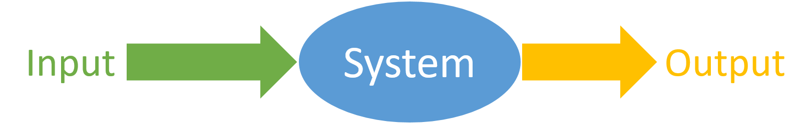
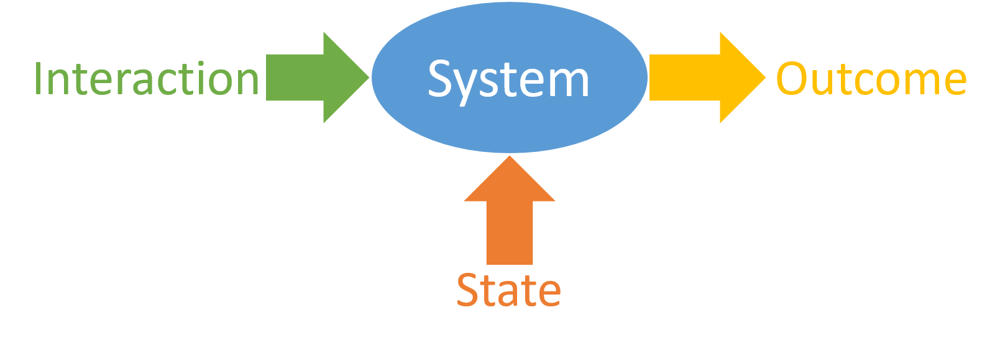

=The States, Interactions and Outcomes Model=

**TL;DR:**  The States, Interactions and Outcomes model provides a way for cross-functional teams to collaboratively explore, specify and document expected system behaviour. 

--------

Specification by Example (SbE) and Behaviour-Driven Development (BDD) can be an incredibly effective way for teams to explore and define their expectations for the behaviour of a system. The States, Interactions and Outcomes Model provides a set of steps, and a lightweight documentation structure for teams to use SbE and BDD more effectively. The best way of conveying the model is through a worked example.

**Worked example**
To demonstrate the model and the process, I will take you through applying it to a problem I use frequently in coaching and training. Imagine we are creating software to calculate the total cost of purchased items at a point of sale. (This problem is inspired by [Dave Thomas' Supermarket Pricing Kata](http://codekata.com/kata/kata01-supermarket-pricing/) and [here](http://codekata.com/kata/kata09-back-to-the-checkout/).) You walk up to a till at a supermarket, hand the check-out person your items one-by-one, and the checkout person starts calculating the total of the items you want to purchase. The total is updated each time the checkout person records an item for purchase.

We would like to include a number of different ways of calculating the total price for purchased items, since the supermarket will want to run promotions from time to time. Some of the pricing methods we would like to include are:

* Simple Pricing: the total cost is calculated simply by adding up the cost of each individual item recorded at the point of sale.
* Three-for-Two Promotion: By three of any particular item, pay for only two. This promotion is specific to the type of item being sold. For example, buy three loaves of Brand-X bread,  pay for only two.
* Combo Deal: A discount is applied when a specific combination of items is purchased.
* Bulk Discount: A discount is applied when more than a specific number of a particular item is purchased.  

In this article I will deal with only 'Simple Pricing' and 'Three-for-Two Promotion'. I will deal first with 'Simple Pricing' completely, and then start with 'Three-for-Two Promotion'.

**Simple Pricing**  
* **System boundaries**: We are concerned only with the way the total for the purchased items is calculated. We are not concerned with things like how the cost of an item is acquired (e.g. barcode scanning), accepting payment etc.  
* **Types of inputs**: For Simple Pricing, the only input is the price of the item being recorded - *item price*.   
* **Types of state**: What affects calculating the total price besides *item price*? For Simple Pricing, the total after recording an item - the new total - is determined by both the price of the captured item, as well as the total before the item is captured. Therefore state consists of *current total*.  
* **Outcome dimensions**: For Simple Pricing, the outcome consists only of the total calculated as a result of capturing an item - *new total*.  
* **Possible values for state types**: *Current total* is an integer, which can be negative, 0, or positive.   
* **Possible values for inputs**: *Item price* is an integer, which can be negative, 0, or positive.  

**Expected outcomes for combinations of state and inputs**:  

|State|Interaction|Outcome||Scenario Name|
|:---|:---|:---|:---|:---|
|Current total|Capture item that costs|New total|Error|
|0|0|0||Free first item|
|0|10|10||First item|
|10|10|20||Second item|
|0|-10||ERROR - item price can't be negative|First item with negative price|
|10|-10||ERROR - item price can't be negative|Second item with negative price|
|10|ABCDEF||ERROR - invalid input|Text input|

**Three-for-Two Promotion**  
* **System boundaries**: The system boundaries don't change compared to Simple Pricing.
* **Types of inputs**: For Three-for-Two Promotion the type or name of the item is now also required as an input - *item type*.   
* **Types of state**: The outcome is now also affected by two other types of state: the types of items already captured - *already captured items*; and the type of Promotion currently active - *Active Promotion*.
* **Outcome dimensions**: For Three-for-Two Promotion, the outcome consists of *new total*, as well as the new list of items that have been captured - *new captured items*.  
* **Possible values for state types**: *Current total* is an integer, which can be negative, 0, or positive. *Active Promotion* is a complex type. It can be 'none' or a promotion for a specific type of item, e.g. 'Buy 3 Cokes, pay for 2'.
* **Possible values for inputs**: *Item price* is an integer, which can be negative, 0, or positive. *Already captured items* specifies the quantity and types of items already captured.  

**Expected outcomes for combinations of state and inputs**:  

|State|||Interaction||Outcome|||Scenario Name|
|:---|:---|:--|:---|:---|:---|:---|:---|:---|
|Active promotion |Current total|Items already captured|Capture|That costs|New total|New captured items|Error|
|-|20|2 Cokes|Coke|10|30|3 Cokes||3rd item with no promotion|
|Buy 3 Cokes pay for 2|20|2 Cokes|Coke|10|20|3 Cokes||3rd qualifying item with 3 for 2 promotion|
|Buy 3 Cokes pay for 2|20|1 Coke, 1 bread|Coke|10|30|2 Cokes, 1 bread||3rd item doesn't trigger promotion|

There are several interesting things about the specifications above to which I'd like to draw particular attention:  
 * All the words and concepts used are domain-level words and concepts. There are no implementation or software-specific words.
 * The specification describes the transactions and outcomes only, not how the work should be done.
 * The things that determine the outcome of a transaction are super-obvious and explicit. This makes it easier to detect and discuss edge cases.
 * Invalid states and interactions are easy to see.
 * The path to any particular state is clear and obvious
 * Should we want to, it would be easy to automate the verification of a system which should satisfy these specifications.

 As mentioned above, I developed and use this model during my coaching and training. It has proven very effective for quickly exploring and documenting system behaviour. In some BDD Bootcamps, we have explored and specified legacy systems running in productions in about 3 hours. One of the ways this has proven useful is people in the bootcamp who have not worked on those particular systems gained a very thorough high-level overview of the *intention* of the system.

**The Thinking Behind The Model** 
The idea behind the model is that the outcome of a system interaction is a function of the interaction and the state of the system at the time of interaction. We can develop a complete and comprehensive specification of expected system behaviour by describing the expected outcome for every possible combination of state and interaction.

The worked example above follows these steps:  
1. Explicitly define and bound the system under specification. What is included, what is excluded?
2. What are the different inputs to the system?
3. What are the types of state that the system can have? Another way to ask this: Besides the inputs, what can affect the outcome of an interaction?
4. What constitutes system outcome? Is any output returned to the user? Note that an outcome must, by definition, include all states as identified above. Outcome can also include error conditions.
5. For each type of state, what are the possible values?
6. For each type of input, what are the possible values?
7. For each combination of state and interaction, what is the expected outcome (including all dimensions)?

**Specification by Example and Behaviour-Driven Development** 
The model and the steps are largely based on the concepts of Specification by Example and Behaviour-Driven Development. Specification by Example (SBE) is the practice of specifying expected system behaviour using concrete values instead of natural-language descriptions. For more on Specification by Example,you can't do better than [Gojko Adzic's book](https://gojko.net/books/specification-by-example/). Behaviour-Driven Development (BDD) uses SBE. One of the reasons I use SBE is that it allows us to work with something tangible, instead of 'invisible ideas'. Some of the benefits of using BDD and SBE are:  

* Getting feedback on the work from a wider audience earlier in the process.
* Making edge cases more obvious. 

Ordinarily, we would need to write some software to achieve these things. By using BDD and SBE we can get these benefits **before** writing any software. However it is not always easy to get started with these techniques.

A common challenge teams face when they start using BDD and SBE is the need to make every aspect of expected externally-observable system behaviour completely explicit. That is, all the factors which affect the behaviour of the system must be identified and made explicit. If any of these factors are missing or unknown, we cannot specify expected system behaviour completely and comprehensively - we will have gaps. It is difficult to develop a successful software product if there are gaps or inconsistencies in what we expect the software to do.

**Understanding systems**  
The steps above are designed to help a team understand the system they're dealing with. The simplest way we can understand the behaviour of a system is as a simple transaction: some entity is stimulated or exercised in a particular way, and the entity does some work. The simplest way of modeling a transaction is by stating that the input to a system determines the output.

In this view, the system output is determined only by the input to the system. I have come to use the terms 'Interaction' and 'Outcome' instead of 'input' and 'output' respectively, because they are closer to the way most people think about working with software products: "I interact with a system to achieve some outcome". 

However, it is important to understand that the outcome of an interaction with a system is determined **not only** by the interaction, but also by the state of the system at the time of the interaction. 

The introduction of state into the picture often causes some challenges. The first challenge is differentiating between *interaction* and *state*. The easiest way to distinguish between them is by asking the question *What determines the outcome of an interaction besides the input?*.

The next challenge is understanding that system state is generally not described by a single value. System state is typically made up of multiple dimensions or types, and therefore must be expressed as a set of concrete values, one value per dimension. The same applies to values supplied to the system as part of an interaction.

Once a team begins thinking in terms of *states, interactions and outcomes*, they're generally able to have more effective conversations around what behaviour they expect from their system.